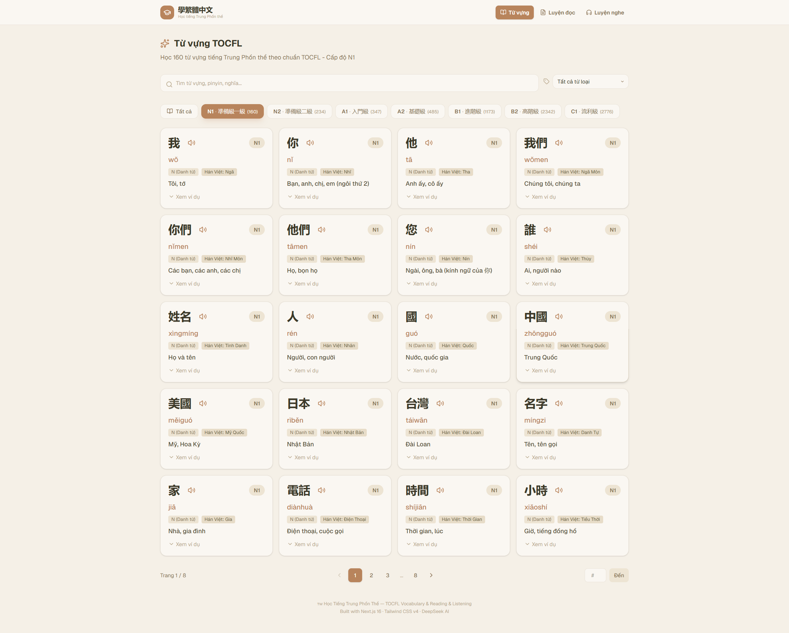
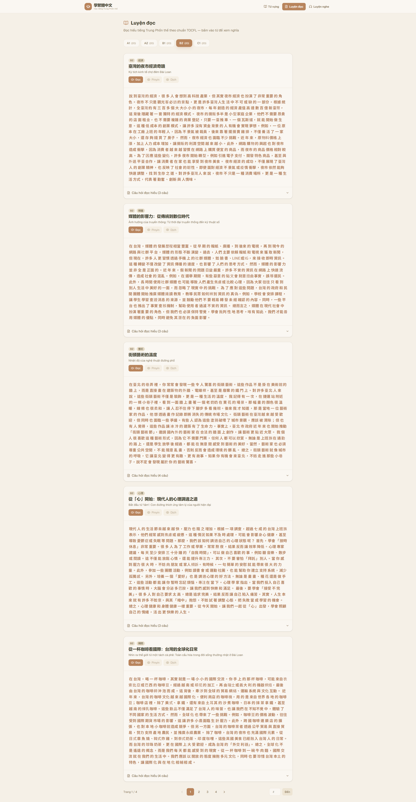
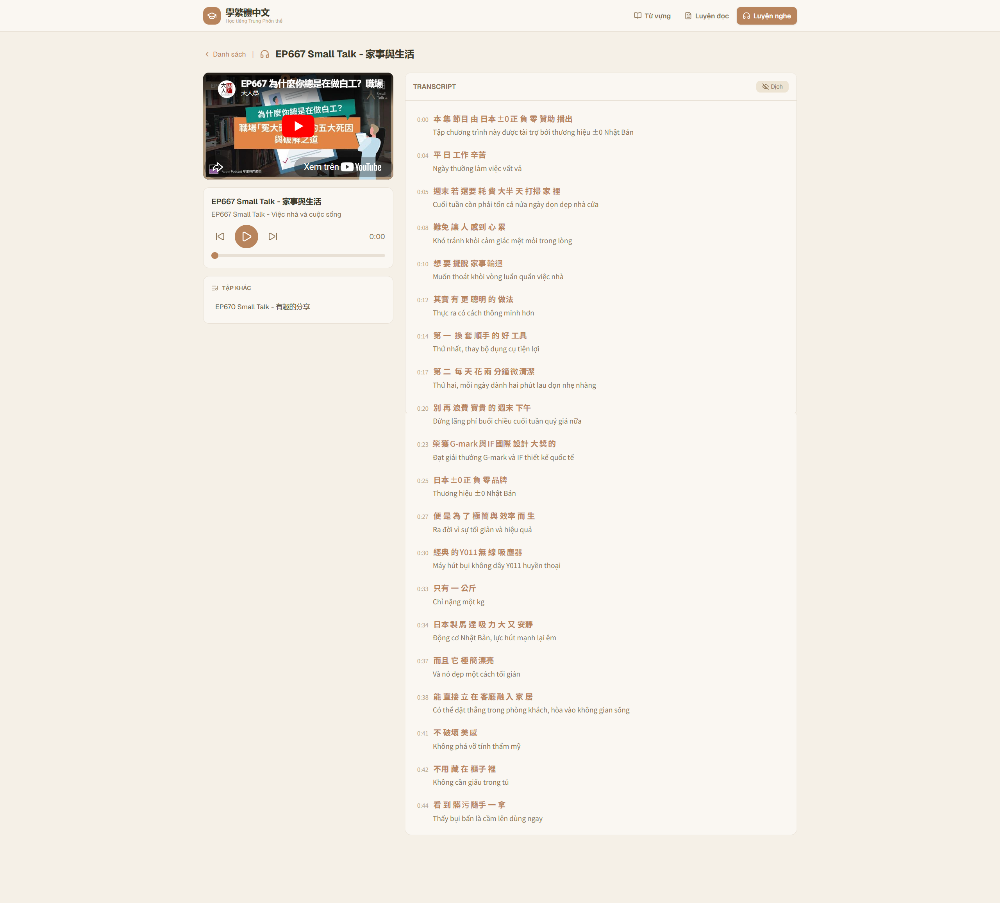

# 📚 Học Tiếng Trung Phồn Thể — TOCFL

<div align="center">

**[🇬🇧 English](#english)** &nbsp;|&nbsp; **[🇻🇳 Tiếng Việt](#vietnamese)** &nbsp;|&nbsp; **[🇨🇳 简体中文](#simplified-chinese)** &nbsp;|&nbsp; **[🇹🇼 繁體中文](#traditional-chinese)**

*Full-stack web app for learning Traditional Chinese — vocabulary, reading & listening practice with AI-powered translations & YouTube podcast sync.*

[]()
[]()
[]()
[]()
[]()
[]()

### 🌐 Live Demo: [https://hoctiengphonthe.netlify.app](https://hoctiengphonthe.netlify.app)

</div>

---

## 📸 Preview / Ảnh chụp màn hình

| 📖 Từ vựng | 📚 Luyện đọc | 🎧 Luyện nghe |
|:---:|:---:|:---:|
|  |  |  |

> 💡 **Tip:** 7,517 từ vựng TOCFL · 100 bài đọc AI · YouTube podcast với transcript đồng bộ

---

## 🇬🇧 English

<a name="english"></a>

### Overview

A comprehensive Traditional Chinese learning platform built for TOCFL (Test of Chinese as a Foreign Language) preparation. Features 7,517 vocabulary words across 7 levels, 100 AI-generated reading passages with quizzes, and YouTube podcast listening with synced transcripts — all translated to Vietnamese via DeepSeek AI.

### Key Features

| Feature | Description |
|---|---|
| 📖 **Vocabulary** | 7,517 words across 7 TOCFL bands (N1–N7) with pinyin, Sino-Vietnamese, POS, and Vietnamese translations |
| 📚 **Reading Practice** | 100 passages with highlighted TOCFL vocabulary, Pinyin/Dịch toggles, quizzes (3–5 questions), and audio playback |
| 🎧 **Listening Practice** | YouTube podcast player with real-time synced transcript, auto-scroll, and Vietnamese translation toggle |
| 🤖 **AI-Powered** | DeepSeek API for vocabulary translation (7,517 words), reading generation (100 passages), and transcript translation |
| 🔊 **Text-to-Speech** | Google TTS via Next.js API proxy with smart text chunking |
| 🌐 **Multi-language UI** | Vietnamese, English, Simplified Chinese, Traditional Chinese |
| 📱 **Responsive** | Mobile, tablet, desktop optimized |

### Architecture

```
┌──────────────────────────────────────────────────────┐
│                    Client (Browser)                   │
│  ┌──────────┐  ┌──────────┐  ┌──────────────────┐   │
│  │ Next.js  │  │ Tailwind │  │ Lucide Icons     │   │
│  │ App Router│  │ CSS v4   │  │                  │   │
│  └──────────┘  └──────────┘  └──────────────────┘   │
├──────────────────────────────────────────────────────┤
│                    API Layer                          │
│  ┌──────────────────┐  ┌────────────────────────┐    │
│  │ /api/tts         │  │ YouTube IFrame API     │    │
│  │ (Google TTS)     │  │ (Real-time sync)       │    │
│  └──────────────────┘  └────────────────────────┘    │
├──────────────────────────────────────────────────────┤
│                    AI Engine                          │
│  ┌──────────────────────────────────────────────┐    │
│  │         DeepSeek API (deepseek-chat)          │    │
│  │  • 7,517 vocabulary translations              │    │
│  │  • 100 reading passages generated             │    │
│  │  • 1,205 transcript lines translated          │    │
│  └──────────────────────────────────────────────┘    │
├──────────────────────────────────────────────────────┤
│                    Data Pipeline                      │
│  ┌──────────┐  ┌──────────┐  ┌──────────────┐       │
│  │ Excel    │  │ SRT      │  │ JSON          │       │
│  │ (TOCFL)  │  │ (YouTube)│  │ (enriched)    │       │
│  └──────────┘  └──────────┘  └──────────────┘       │
└──────────────────────────────────────────────────────┘
```

### Tech Stack

| Category | Technology | Notes |
|---|---|---|
| Framework | Next.js 16 (App Router) | Turbopack, Server Components |
| Language | TypeScript (strict) | Type safety across the stack |
| Styling | Tailwind CSS v4 | Utility-first, warm cream theme |
| Icons | Lucide React | Lightweight, consistent |
| AI | DeepSeek API | Translation + content generation |
| TTS | Google TTS | Via Next.js API proxy |
| Font | Noto Sans TC | Traditional Chinese optimized |
| Deployment | Netlify | Free hosting, auto CI/CD |

### Project Structure

```
hoctiengphonthe/
├── tocfl-app/                    # Next.js application
│   ├── src/
│   │   ├── app/
│   │   │   ├── layout.tsx        # Root layout + fonts
│   │   │   ├── page.tsx          # Vocabulary page
│   │   │   ├── reading/
│   │   │   │   └── page.tsx      # Reading practice
│   │   │   ├── listening/
│   │   │   │   └── page.tsx      # YouTube podcast + transcript
│   │   │   └── api/
│   │   │       └── tts/
│   │   │           └── route.ts  # Google TTS proxy
│   │   ├── components/
│   │   │   ├── Navbar.tsx        # Navigation with active state
│   │   │   ├── WordCard.tsx      # Vocabulary card + audio
│   │   │   ├── ReadingCard.tsx   # Reading passage + quiz
│   │   │   ├── HomePage.tsx      # Vocabulary list + filters
│   │   │   ├── LevelFilter.tsx   # TOCFL band filter
│   │   │   ├── PosFilter.tsx     # Part-of-speech filter
│   │   │   └── Pagination.tsx    # Page navigation
│   │   └── lib/
│   │       └── types.ts          # TypeScript definitions
│   ├── public/
│   │   └── podcasts/             # Podcast episodes (ep01–ep10)
│   │       ├── list.json         # Podcast index
│   │       └── epXX/
│   │           ├── info.json     # Episode metadata
│   │           ├── transcript.txt    # Chinese transcript
│   │           └── transcript_vi.txt # Vietnamese translation
│   └── package.json
├── data/
│   ├── all_enriched.json         # 7,517 translated words
│   └── readings.json             # 100 reading passages
├── translate_all.py              # Vocabulary translation script
├── generate_readings.py          # Reading passage generator
├── translate_transcript.py       # Transcript translation script
└── netlify.toml                  # Netlify deployment config
```

### Data Pipeline Scripts

| Script | Description | Output |
|---|---|---|
| `translate_all.py` | Translates 7,517 vocabulary words via DeepSeek API | `data/all_enriched.json` |
| `generate_readings.py` | Generates 20 reading passages per TOCFL band | `data/readings.json` |
| `translate_transcript.py` | Translates SRT transcripts to Vietnamese | `transcript_vi.txt` per episode |

---

## 🇻🇳 Tiếng Việt

<a name="vietnamese"></a>

### Tổng Quan

Nền tảng học tiếng Trung Phồn thể toàn diện, xây dựng cho kỳ thi TOCFL. Gồm 7.517 từ vựng chia 7 cấp độ, 100 bài đọc có quiz do AI tạo, và luyện nghe YouTube podcast với transcript đồng bộ — tất cả được dịch sang tiếng Việt qua DeepSeek AI.

### Tính Năng Chính

| Tính năng | Mô tả |
|---|---|
| 📖 **Từ vựng** | 7.517 từ chia 7 cấp TOCFL (N1–N7) kèm pinyin, Hán Việt, từ loại, nghĩa tiếng Việt |
| 📚 **Luyện đọc** | 100 bài đọc với từ vựng TOCFL được tô sáng, toggle Pinyin/Dịch, quiz (3–5 câu), phát audio |
| 🎧 **Luyện nghe** | YouTube podcast với transcript đồng bộ real-time, auto-scroll, toggle bản dịch |
| 🤖 **AI** | DeepSeek API dịch từ vựng (7.517 từ), tạo bài đọc (100 bài), dịch transcript |
| 🔊 **Text-to-Speech** | Google TTS qua Next.js API proxy, tự động chia đoạn văn bản dài |
| 🌐 **Đa ngôn ngữ** | Tiếng Việt, English, 简体中文, 繁體中文 |

### Kiến Trúc

```
┌──────────────────────────────────────────────────────┐
│                    Client (Browser)                   │
│  ┌──────────┐  ┌──────────┐  ┌──────────────────┐   │
│  │ Next.js  │  │ Tailwind │  │ Lucide Icons     │   │
│  │ App Router│  │ CSS v4   │  │                  │   │
│  └──────────┘  └──────────┘  └──────────────────┘   │
├──────────────────────────────────────────────────────┤
│                    API Layer                          │
│  ┌──────────────────┐  ┌────────────────────────┐    │
│  │ /api/tts         │  │ YouTube IFrame API     │    │
│  │ (Google TTS)     │  │ (Đồng bộ real-time)    │    │
│  └──────────────────┘  └────────────────────────┘    │
├──────────────────────────────────────────────────────┤
│                    AI Engine                          │
│  ┌──────────────────────────────────────────────┐    │
│  │         DeepSeek API (deepseek-chat)          │    │
│  │  • 7.517 bản dịch từ vựng                    │    │
│  │  • 100 bài đọc được tạo                      │    │
│  │  • 1.205 dòng transcript được dịch           │    │
│  └──────────────────────────────────────────────┘    │
├──────────────────────────────────────────────────────┤
│                    Data Pipeline                      │
│  ┌──────────┐  ┌──────────┐  ┌──────────────┐       │
│  │ Excel    │  │ SRT      │  │ JSON          │       │
│  │ (TOCFL)  │  │ (YouTube)│  │ (đã dịch)     │       │
│  └──────────┘  └──────────┘  └──────────────┘       │
└──────────────────────────────────────────────────────┘
```

### Công Nghệ Sử Dụng

| Hạng mục | Công nghệ | Ghi chú |
|---|---|---|
| Framework | Next.js 16 (App Router) | Turbopack, Server Components |
| Ngôn ngữ | TypeScript (strict) | Type safety toàn diện |
| Styling | Tailwind CSS v4 | Utility-first, theme kem ấm |
| Icons | Lucide React | Nhẹ, đồng nhất |
| AI | DeepSeek API | Dịch thuật + tạo nội dung |
| TTS | Google TTS | Qua Next.js API proxy |
| Font | Noto Sans TC | Tối ưu cho chữ Phồn thể |
| Deploy | Netlify | Hosting miễn phí, CI/CD tự động |

---

## 🇨🇳 简体中文

<a name="simplified-chinese"></a>

### 概述

面向 TOCFL 备考的繁体中文学习平台。包含 7,517 个词汇（7 个等级）、100 篇 AI 生成阅读文章（附测验）以及 YouTube 播客听力（带同步字幕）——全部通过 DeepSeek AI 翻译为越南语。

### 核心功能

| 功能 | 说明 |
|---|---|
| 📖 **词汇** | 7,517 词，7 个 TOCFL 等级（N1–N7），含拼音、汉越音、词性、越南语翻译 |
| 📚 **阅读练习** | 100 篇文章，高亮 TOCFL 词汇，拼音/翻译切换，测验（3–5 题），音频播放 |
| 🎧 **听力练习** | YouTube 播客播放器，实时同步字幕，自动滚动，翻译切换 |
| 🤖 **AI 驱动** | DeepSeek API 翻译词汇（7,517 词）、生成文章（100 篇）、翻译字幕 |
| 🔊 **语音合成** | Google TTS，通过 Next.js API 代理，智能文本分段 |

### 技术栈

| 类别 | 技术 | 备注 |
|---|---|---|
| 框架 | Next.js 16 (App Router) | Turbopack, Server Components |
| 语言 | TypeScript (strict) | 全栈类型安全 |
| 样式 | Tailwind CSS v4 | Utility-first，暖色调主题 |
| AI | DeepSeek API | 翻译 + 内容生成 |
| 部署 | Netlify | 免费托管，自动 CI/CD |

---

## 🇹🇼 繁體中文

<a name="traditional-chinese"></a>

### 概述

面向 TOCFL 備考的繁體中文學習平台。包含 7,517 個詞彙（7 個等級）、100 篇 AI 生成閱讀文章（附測驗）以及 YouTube 播客聽力（帶同步字幕）——全部透過 DeepSeek AI 翻譯為越南語。

### 核心功能

| 功能 | 說明 |
|---|---|
| 📖 **詞彙** | 7,517 詞，7 個 TOCFL 等級（N1–N7），含拼音、漢越音、詞性、越南語翻譯 |
| 📚 **閱讀練習** | 100 篇文章，高亮 TOCFL 詞彙，拼音/翻譯切換，測驗（3–5 題），音頻播放 |
| 🎧 **聽力練習** | YouTube 播客播放器，即時同步字幕，自動滾動，翻譯切換 |
| 🤖 **AI 驅動** | DeepSeek API 翻譯詞彙（7,517 詞）、生成文章（100 篇）、翻譯字幕 |
| 🔊 **語音合成** | Google TTS，透過 Next.js API 代理，智慧文本分段 |

### 技術棧

| 類別 | 技術 | 備註 |
|---|---|---|
| 框架 | Next.js 16 (App Router) | Turbopack, Server Components |
| 語言 | TypeScript (strict) | 全棧型別安全 |
| 樣式 | Tailwind CSS v4 | Utility-first，暖色調主題 |
| AI | DeepSeek API | 翻譯 + 內容生成 |
| 部署 | Netlify | 免費託管，自動 CI/CD |

---

## 👨‍💻 About the Author

**Nguyễn Trường Duy (阮長維)** — Aspiring CS student applying to Taiwan universities.

- 🇹🇼 TOCFL Chinese proficiency
- 💻 Full-stack development — Next.js, TypeScript, AI integration
- 🎯 Target: Taiwan CS Master's Program

### Why This Project Stands Out

- **7,517 vocabulary words** with Vietnamese translations, Sino-Vietnamese, and pinyin
- **Real-time YouTube transcript sync** using IFrame API + requestAnimationFrame
- **AI-powered content pipeline**: DeepSeek for translation + generation
- **Professional data engineering**: Excel → JSON, SRT parsing, batch translation with resume

Built with ❤️ using Next.js 16, Tailwind CSS v4, DeepSeek API — May 2026
